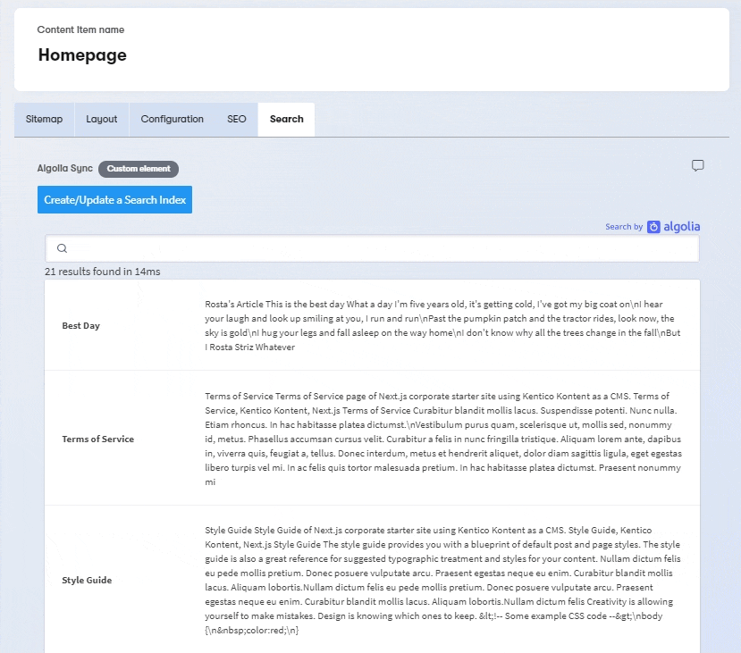
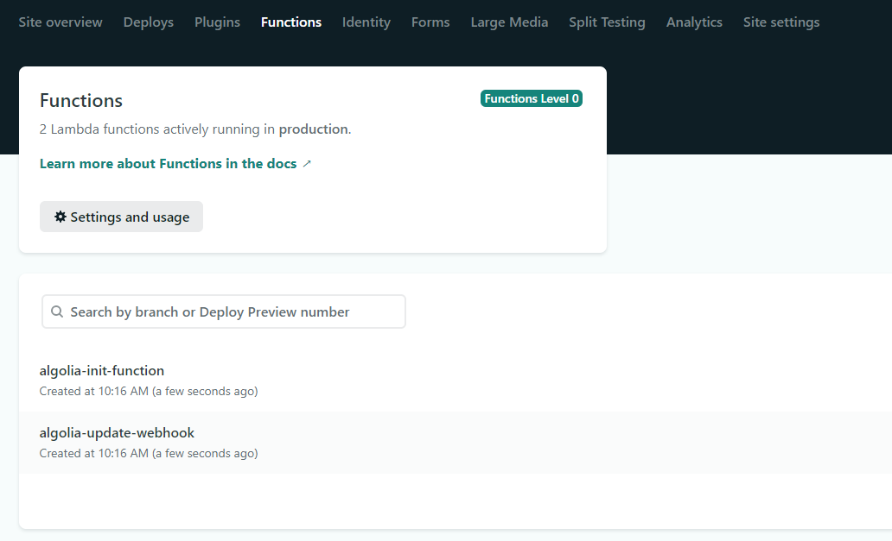
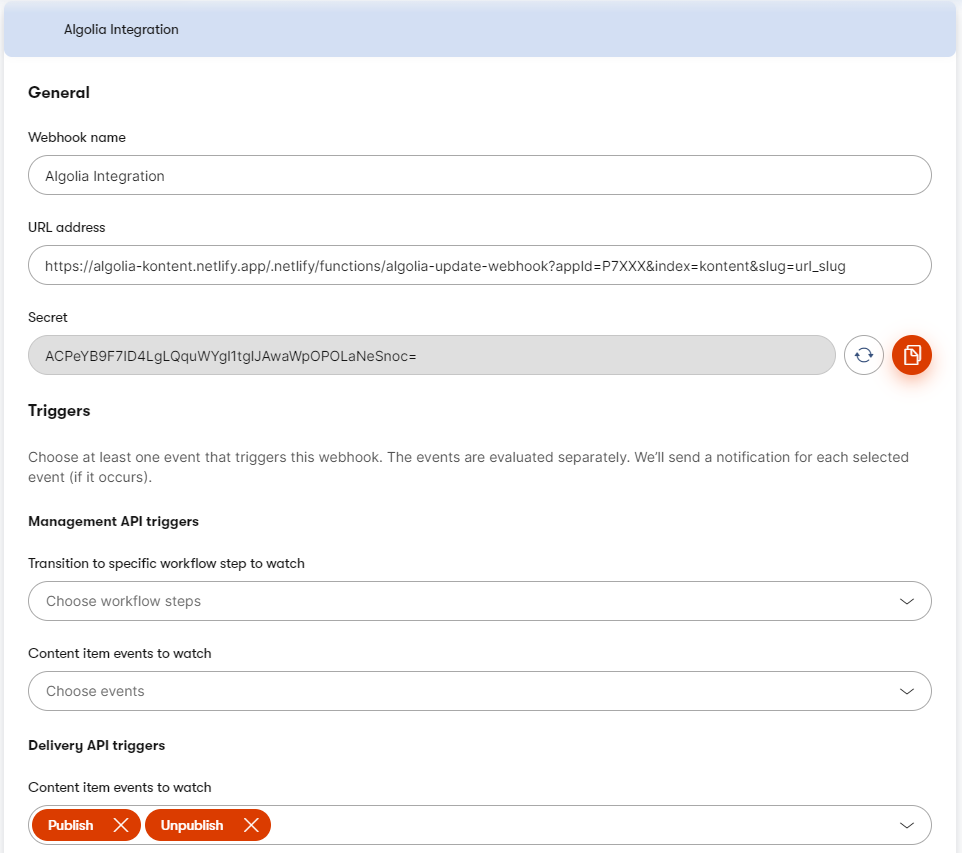
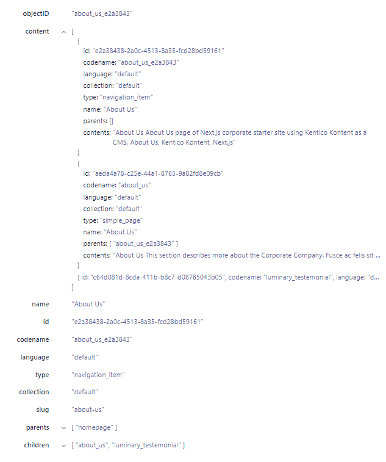

[![Core integration][core-shield]](https://kontent.ai/integrations/algolia)
[![Gallery][gallery-shield]](https://kentico.github.io/kontent-custom-element-samples/gallery/)

![Last modified][last-commit]
[![Issues][issues-shield]][issues-url]
[![Contributors][contributors-shield]][contributors-url]
[![Forks][forks-shield]][forks-url]
[![MIT License][license-shield]][license-url]

[![Stack Overflow][stack-shield]](https://stackoverflow.com/tags/kentico-kontent)
[![GitHub Discussions][discussion-shield]](https://github.com/Kentico/Home/discussions)

<p align="center">
<image src="docs/01-kk-logo-main.svg" alt="kontent logo" width="200" />
<image src="docs/algolia-logo.png" alt="algolia logo" width="300">
</p>

<p align="center">
  <a href="#demo">Demo</a> •
  <a href="#prerequisities">Prerequisities</a> •
  <a href="#get-started">Get started</a> •
  <a href="#search-data-structure">Search data structure</a> •
  <a href="#developing">Developing</a> •
  <a href="#contributors">Contributors</a> •
  <a href="#license">License</a> •
  <a href="#additional-resources">Resources</a>
</p>

This repository contains an _example implementation_ of integration between [Algolia](https://www.algolia.com/) search engine and [Kentico Kontent](https://kontent.ai/)  headless CMS. It produces an optional [custom element](https://docs.kontent.ai/tutorials/develop-apps/integrate/content-editing-extensions) for indexing your content in Algolia with a search preview functionality, as well as **two** [Netlify functions](https://docs.netlify.com/functions/overview/) for the **initial setup** and subsequent **processing of content changes** via a [webhook](https://docs.kontent.ai/tutorials/develop-apps/integrate/webhooks).

This implementation also supports **tracking changes in [linked content](https://docs.kontent.ai/tutorials/write-and-collaborate/structure-your-content/link-related-content-together)**, as well as **searching in multiple languages**. 

## Demo


## Prerequisities
1. To run this integration, you'll need your Kentico Kontent project + Algolia account. 
2. The content you want to be returned upon searching has to contain some kind of universal **[slug property](https://itnext.io/whats-a-slug-f7e74b6c23e0)** (of any type). (_Kentico Kontent supports a [SEO-friently way to work with URLs](https://docs.kontent.ai/tutorials/develop-apps/optimize-your-app/seo-friendly-urls) through URL slugs_). 

## Get Started

1. ### Quick Deploy
    Netlify has made this easy. If you click the deploy button below, it will guide you through the process of deploying it to Netlify and leave you with a copy of the repository in your account as well.

    [](https://app.netlify.com/start/deploy?repository=https://github.com/Kentico/kontent-example-integration-algolia)

    After you deploy the project into Netlify, you'll find two functions there:
    
    1. **algolia-init-function** is the function that indexes or refreshes all of your content from Kontent into Algolia. 
    2. **algolia-update-webhook** is the function you want to call via a webhook from Kontent to notify Algolia there's been a change to your content and that it has to be updated and how. 

2. ### Create a new Webhook in Kentico Kontent
    The next step is [creating a new webhook in Kentico Kontent](https://docs.kontent.ai/tutorials/develop-apps/integrate/webhooks#a-create-a-webhook). 

    Fill out the following into the webhook's **URL address** field:

    {**algolia-update-webhook endpoint URL**}?appId={**algolia application id**}&index={**algolia search index name**}&slug={**codename of content's slug property**}

    Subsequently, set the Kontent's **Delivery API triggers** to watch for _Publish_ and _Unpublish_ of your content items. 

    At the end, this is an example of how your webhook might look like:

    

    Save the webhook and copy the generated **secret** as it would be required as a parameter in the following step.

3. ### Configure your Netlify functions

    To **setup** both function, all you need to do is set the following **[environment variables](https://docs.netlify.com/configure-builds/environment-variables/)** for your Netlify site. 

    Variable | Value |
    --- | --- |
    ALGOLIA_API_KEY |  your [Algolia Admin key](https://www.algolia.com/doc/guides/security/api-keys/#admin-api-key) | 
    KONTENT_SECRET | your [Kontent webhook secret](https://docs.kontent.ai/tutorials/develop-apps/integrate/webhooks#a-validate-received-notifications)

    The Algolia admin key is used by the function to create/recreate your search index, as well as for indexing your content.

    The Kontent webhook secret is used to ensure integrity of the webhook payload. It has been created in the previous step.

    After your function has been redeployed (or your environment variables has been propagated), the functions are ready to be called. 
    
    You can observe the real-time **Function log** on the same screen you'd find your function's endpoint (_Functions_ -> _your function_). 

4. ### Run the index initialization 
    The initialization of your Algolia index with your content is done through the **algolia-init-function**. Simply make a POST request towards the function's endpoint URL with the following payload:

    ```
    {
      "projectId":"{Kontent's project ID}",
      "language":"{Kontent's language codename}",
      "slug":"{Kontent's slug codename}",
      "appId":"{Algolia's app id}",
      "index":"{Algolia's index name}"
    }
    ```
    The function processes all **published** content from your project (based on the given ID) and creates or updates the search index in Algolia (again, based on the given parameter). 
    
    Alternatively, you can use the **custom element** that is a part of this repository as well. 

    Simply add a new [custom element]((https://docs.kontent.ai/tutorials/develop-apps/integrate/content-editing-extensions)) into your content model (it might be a good idea to create some kind of _meta_ content type to store some of the project's settings, so that would be a good place to put this element as well). 

    Use your netlify's URL for the base page as the **Hosted code URL** and a following settings to setup the custom element:

    ```
    {
    "algoliaAppId": "{Algolia's app id}",
    "algoliaSearchKey": "{Algolia's search-only api key}",
    "algoliaIndexName": "{Algolia's index name}"
    "slugCodename": "{Kontent's slug codename}",    
    }
    ```
    The [Algolia's search-only api key](https://www.algolia.com/doc/guides/security/api-keys/#search-only-api-key) is used to preview the search functionality from within the custom element.

    The custom element allow's you to (re)initialize your Algolia index with all of your content + offers a way to preview your search results. 
    <a href="#demo">**Check out the demo gif above!**</a>

    If you are working with content in [multiple language variants](https://docs.kontent.ai/tutorials/write-and-collaborate/create-multilingual-content/translate-content-items), adding additional variants to your search index is just as easy as just simply switching to the desired variant and activating the custom element to sync all content of the selected variant. 

## Search data structure
When building your search UI, you'll need to understand how the data is being stored inside of your Algolia search index. You can see an example of a content item with slug (i.e. separate "page"), that is linked to a Homepage page and contains its own content, as well as two linked items. 



You can explore your own generated index to figure out how to implement your search, as well as the code of this custom element that is already implementing a previw of the search functionality [here](src/algolia-sync.js).

## Developing
[Netlify Dev](https://www.netlify.com/products/dev/) is highly recommended for local development. 

```bash
# Initial project setup
$ npm install

# Build the project
$ npm run build

# Run locally
$ netlify dev
```

## Contributors
We have collected notes on how to contribute to this project in [CONTRIBUTING.md](CONTRIBUTING.md).

<a href="https://github.com/strizr/kontent-algolia-sync/graphs/contributors">
  
</a>

## License

[MIT](https://tldrlegal.com/license/mit-license)

## Additional Resources

- [Custom Element Gallery on github](https://kentico.github.io/kontent-custom-element-samples/gallery/)
- [Kentico Kontent's Integration documentation](https://docs.kontent.ai/tutorials/develop-apps/integrate/integrations-overview)


[last-commit]: https://img.shields.io/github/last-commit/strizr/kontent-algolia-sync?style=for-the-badge
[contributors-shield]: https://img.shields.io/github/contributors/strizr/kontent-algolia-sync.svg?style=for-the-badge
[contributors-url]: https://github.com/strizr/kontent-algolia-sync/graphs/contributors
[forks-shield]: https://img.shields.io/github/forks/strizr/kontent-algolia-sync.svg?style=for-the-badge
[forks-url]: https://github.com/strizr/kontent-algolia-sync/network/members
[stars-shield]: https://img.shields.io/github/stars/strizr/kontent-algolia-sync.svg?style=for-the-badge
[stars-url]: https://github.com/strizr/kontent-algolia-sync/stargazers
[issues-shield]: https://img.shields.io/github/issues/strizr/kontent-algolia-sync.svg?style=for-the-badge
[issues-url]: https://github.com/strizr/kontent-algolia-sync/issues
[license-shield]: https://img.shields.io/github/license/strizr/kontent-algolia-sync.svg?style=for-the-badge
[license-url]: https://github.com/strizr/kontent-algolia-sync/blob/master/LICENSE
[core-shield]: https://img.shields.io/static/v1?label=&message=core%20integration&style=for-the-badge&color=FF5733
[gallery-shield]: https://img.shields.io/static/v1?label=&message=extension%20gallery&style=for-the-badge&color=51bce0
[stack-shield]: https://img.shields.io/badge/Stack%20Overflow-ASK%20NOW-FE7A16.svg?logo=stackoverflow&logoColor=white&style=for-the-badge
[discussion-shield]: https://img.shields.io/badge/GitHub-Discussions-FE7A16.svg?logo=github&style=for-the-badge
[product-demo]: docs/demo.gif?raw=true
